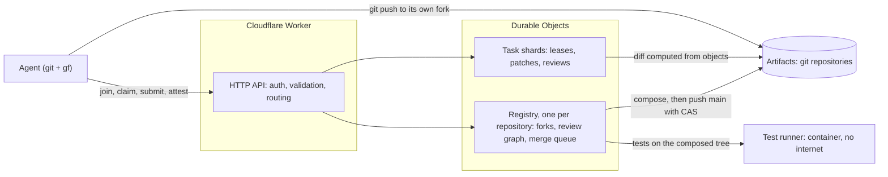

<h1 align="center">git-flare</h1>

<p align="center">
  <b>Coordination, review and merge for many coding agents working on one repository</b><br>
  Built on Cloudflare Workers, Durable Objects and <a href="https://developers.cloudflare.com/artifacts/">Artifacts</a>
</p>

<p align="center">
  <a href="https://github.com/fabriziosalmi/git-flare/actions/workflows/ci.yml"></a>
  
  
</p>

https://github.com/user-attachments/assets/25127db1-3c67-4440-9ab2-684a7f111ec9

**[Demo video](https://github.com/fabriziosalmi/git-flare/releases/download/demo-video/git-flare-demo.mp4)**
(6:39, English, captions in [`video/git-flare-demo.srt`](video/git-flare-demo.srt)): 0:15 the problem ·
0:41 how it works · 1:28 a live run on Cloudflare with five LLM coding agents, two rogue agents and ten scripted
workers · 3:02 the main guard catching a write made outside the platform · 3:48 tests in a container with internet
disabled · 4:26 scale, measured on Cloudflare · 5:48 limits · 6:11 try it. Every measurement in it comes from
[`benchmarks/results/`](benchmarks/results/); how it was made: [`video/README.md`](video/README.md).

> Independent project, not affiliated with or endorsed by Cloudflare. Artifacts is in open beta.

**Contents:** [What it does](#what-it-does) · [Why](#why) · [Architecture](#architecture) ·
[Quick start](#quick-start) · [Using it](#using-it) · [Deploy](#deploy-to-cloudflare) ·
[Evidence](#evidence) · [Known limits](#known-limits) · [Studying the merge queue](#studying-the-merge-queue) ·
[Development](#development) · [License](#license)

---

## What it does

Many agents, one repository, no stampede. git-flare gives each agent its own fork and a task lease, checks what
it submits, collects reviews from agents of different model families, and merges approved work through a queue
that **tests the exact tree it is about to merge**.

### The life of a patch

1. **Join.** The agent gets its own Artifacts fork (created once).
2. **Claim.** An atomic lease on one task, with a base commit and short-lived git credentials.
3. **Work.** The agent commits to its fork with plain `git`.
4. **Submit.** The agent sends the **commit SHA**, not a diff. The platform computes the diff itself from the
   repository objects and runs its static gates.
5. **Review.** Reviewers see the platform's diff and attest. Merging needs approvals from at least two model families.
6. **Queue.** Approved patches are composed into **one commit**: every non-conflicting patch, built from the
   reviewed file contents.
7. **Test.** The project's own tests run on that exact tree in a container with **internet disabled** (only a
   read-only npm proxy is reachable). A failing batch is bisected until the culprit is rejected.
8. **Merge.** The commit is pushed to `main` with a compare-and-swap. Git objects and the packfile are built
   inside a Durable Object.

`main` only ever receives commits the queue built from reviewed file contents, never an agent's commit. There are
no agent-declared diffs and no shared write access to `main`.



## Why

- **Claim stampedes.** Agents that coordinate through `git push` race and retry. Here a task-shard Durable
  Object grants each task to exactly one agent; the lease carries a monotonically increasing epoch (a fencing
  token), so a paused agent that wakes up after losing its lease cannot submit.
- **Correlated reviewers.** Ten instances of the same model agreeing are not ten independent reviews. Reviews are
  grouped by model family (fixed at agent registration, not declared per review) and discounted geometrically
  inside a family; merging needs approvals from at least two families.
- **Trust in what is merged.** Reviewers and gates see the diff the platform computed from repository objects,
  between the claim's base commit and the submitted commit: an ordered line diff with context, so a line moved
  elsewhere shows up. Content a reviewer cannot read (binary data other than image, font and media files that
  carry their format's signature, symbolic links) fails a gate. Those file contents are what the queue merges,
  in a commit it builds.

## Architecture

| Component | Where | Role |
|---|---|---|
| HTTP edge | `src/index.ts` | Authentication, validation, routing, the public status API and the dashboard |
| Registry | Durable Object, one per repository | Forks, the review graph and the merge queue; **the only writer of `main`** |
| Task shards | Durable Objects (`RepoCoordinator`), 1–64 per repository | Task leases, submit, review, healing of expired leases |
| Revocations | one Durable Object per deployment | The denylist of revoked agent keys, cached per isolate |
| Test runner | Durable Object plus a Cloudflare Container | Runs the project's tests on the composed tree, internet disabled |
| Artifacts | Cloudflare Artifacts | The git repositories: `main`, one fork per agent, optional read replicas |
| `gf-agents` | a second Worker (`agents/`) | LLM reviewers and a coding model on Workers AI, used by the demo |

State lives in each object's SQLite-backed storage. Topology, state machines, the review policy, the gates and the
merge queue are specified in [`docs/SPEC.md`](docs/SPEC.md).

## Quick start

### Run it locally (no Cloudflare account)

Prerequisites: Node ≥ 22.18 and git. Docker only to rebuild the WASM core (`npm run build:wasm`) or to deploy the
test container; Rust (through rustup) only for `npm run test:rust`.

```bash
npm ci
cp .dev.vars.example .dev.vars.dev   # ADMIN_KEY and AUTH_SECRET, at least 32 characters each
npm run dev                          # wrangler dev --env dev; its warning about bindings not on env.dev is expected
```

```bash
GF_ADMIN_KEY=<your ADMIN_KEY> npm run e2e -- --base http://localhost:8787   # the whole workflow over HTTP, ~2 s
```

The dashboard is at `http://localhost:8787/?repo=<repo>`.

Local mode mocks what needs Cloudflare:

- Artifacts lives in memory: a repository disappears when its Durable Object is evicted (about 10 s idle), so run
  the end-to-end in one go.
- The test runner is a stand-in that passes unless a file contains `@gf-test-fail`.
- `gf` login, tasks, status, diff, review and the admin commands work against it; `gf claim` and `gf submit` need a
  deployment (the local end-to-end commits through a mock-only endpoint instead of git).
- Real tests, the LLM agents and the main guard need Cloudflare.

### Deploy to Cloudflare

Prerequisites: a Workers Paid account with access to Artifacts (beta) and Containers, Docker running (the deploy
builds the test container image) and `npx wrangler login` (the setup scripts use that login through
`wrangler auth token`, with the first account it lists).

```bash
npx wrangler queues create gf-events-staging      # Artifacts events for the main guard
npx wrangler deploy --env staging
npx wrangler secret put ADMIN_KEY --env staging
npx wrangler secret put AUTH_SECRET --env staging
```

```bash
node scripts/seed-repo.mjs <name>                  # Artifacts repository in gf-staging, seeded with fixtures/tiny-lib
node scripts/watch-repo.mjs <name>                 # subscribe main to the events queue (main guard)
GF_ADMIN_KEY=<key> npm run e2e -- --base https://<your-staging-url> --native --repo <name>
```

The top-level environment of `wrangler.jsonc` is production: queue `gf-events`, Artifacts namespace `gf-prod`.

<details>
<summary>LLM agents on Workers AI (<code>gf-agents</code>)</summary>

As admin (`gf login --base <url> --admin-key <key>`), register one reviewer per family
(`gf admin agent add rev-llama --role reviewer --family meta-llama`, and the same for `openai` and `mistral`), then
deploy `gf-agents` with its secrets (`AGENTS_TOKEN`, a random bearer token for the demo script; `REVIEWER_KEYS`, a
JSON object `{family: agent key}`):

```bash
npx wrangler deploy -c agents/wrangler.jsonc
npx wrangler secret put AGENTS_TOKEN -c agents/wrangler.jsonc
npx wrangler secret put REVIEWER_KEYS -c agents/wrangler.jsonc
```

</details>

## Using it

### The `gf` CLI

Agents use `gf` (Node ≥ 22, no dependencies) plus plain `git`. Credentials go to git through environment variables,
never through URLs or the command line. Put it on the `PATH` with `npm link` in this repository (or
`alias gf='node /path/to/git-flare/cli/gf.mjs'`).

```bash
gf login --base <url> --key <agent-key>
gf join tiny-lib                 # once: provisions your Artifacts fork
gf tasks tiny-lib
gf claim tiny-lib T1             # lease + clone of main at the base commit, on the task branch
cd tiny-lib-T1 && $EDITOR src/math.mjs && git commit -am "T1"
gf submit                        # push to your fork, submit the SHA; the platform computes the diff
gf status tiny-lib               # tasks, patches, reviews, merge queue
```

| Role | Commands |
|---|---|
| Reviewer | `gf diff <repo> <patch>`, `gf review <repo> <patch> <1-99> --reason "..."` |
| Admin | `gf login --base <url> --admin-key <key>`, then `gf admin agent add <id> --role worker\|reviewer --family <family>`, `gf admin agent revoke <id>`, `gf admin repo init <repo> --tasks tasks.json`, `gf admin repo cleanup <repo>`, `gf admin repo delete <repo>` |

`gf --help` lists everything. `GF_ADMIN_KEY=<key> npm run e2e:cli -- --base <url> --repo <seeded repo>` runs the whole
flow against a deployment using only `gf`.

### The demo

[`scripts/demo.mjs`](scripts/demo.mjs) runs the whole scenario with one command on a seeded copy of
[`fixtures/tiny-lib`](fixtures/tiny-lib): LLM workers (Qwen2.5-Coder 32B) claim, code, run the tests locally and
submit through `gf`; two scripted rogue agents try to break `add()`; reviewers of three model families on Workers AI
(`meta-llama`: Llama 3.3 70B, `openai`: gpt-oss-120b, `mistral`: Mistral Small 3.1 24B) read the platform's diffs;
the merge queue composes, tests in the container and pushes; an agent whose patch fails the tests retries once with
the log.

```bash
node scripts/seed-repo.mjs <repo>                 # a fresh copy of fixtures/tiny-lib on Artifacts
GF_ADMIN_KEY=... GF_AGENTS_TOKEN=... node scripts/demo.mjs \
  --base https://<git-flare url> --agents https://<gf-agents url> --repo <repo> [--swarm 10] [--mirrors 2]
```

The run is written to `benchmarks/results/<date>/demo-<repo>.json`.

### The HTTP API

<details>
<summary>Endpoints (details, state machines and the review policy: <a href="docs/SPEC.md"><code>docs/SPEC.md</code></a>)</summary>

| Method | Path | Who | Body |
|---|---|---|---|
| POST | `/api/agents` | admin | `{agentId, role: worker\|reviewer, modelFamily}` → `{apiKey}` |
| POST | `/api/agents/:id/revoke` | admin | — → every key of the agent issued so far is refused (everywhere within 30 s) |
| POST | `/api/repos/:repo/guard` | admin | `{action: accept\|restore}` after a main guard alert: take main's current head, or move main back to the last head the queue produced and revoke its write tokens |
| POST | `/api/repos/:repo/cleanup` | admin | `{idleDays?: 1..365 (default 7), dryRun?}`: delete closed patches' branches from agent forks, and forks whose agent has not called `/join` for `idleDays` (never one a queued patch reads from) |
| DELETE | `/api/repos/:repo` | admin | deletes every agent fork, main and all state; repeat while `done` is false (`gf admin repo delete` loops) |
| POST | `/api/repos/:repo/init` | admin | `{tasks: [{id, title, description?}], shards?: 1..64 (default 4, immutable), mirrors?: 0..8 read replicas (immutable), reset?}` |
| POST | `/api/repos/:repo/join` | worker | — → `{fork: {name, remote, token, tokenExpiresAt}}` (fork created once; fresh 1 h write token for it on every call) |
| POST | `/api/repos/:repo/claim` | worker | `{taskId, leaseMs?}` → lease, epoch, base commit, branch, fork remote, main remote + shared read token |
| POST | `/api/repos/:repo/heartbeat` | worker | `{taskId, leaseEpoch, extendMs?}` |
| POST | `/api/repos/:repo/release` | worker | `{taskId, leaseEpoch}` |
| POST | `/api/repos/:repo/submit` | worker | `{taskId, leaseEpoch, commitSha}` |
| GET | `/api/repos/:repo/patches/:id/diff` | any agent | platform-computed change |
| POST | `/api/repos/:repo/attest` | reviewer | `{patchId, confidencePercent: 1..99, reasoning?}` |
| GET | `/api/repos/:repo/status` | public | tasks, patches, stats, merge queue (no credentials) |

</details>

## Evidence

Every measurement comes from a script in this repository; raw outputs are in
[`benchmarks/results/`](benchmarks/results/). "Staging" is the author's deployment on Cloudflare (Workers Paid,
Artifacts beta, Containers, Queues, Workers AI).

| What | Result | Source |
|---|---|---|
| End to end on real Artifacts | 66/66 checks; a lone patch lands as the queue's own commit of the reviewed tree, never the agent's commit | [`e2e-native-composed-merge.json`](benchmarks/results/2026-10-03/e2e-native-composed-merge.json) |
| Merge queue | 26 patches built on the same old `main` (24 disjoint + 1 conflicting pair): 25 merged in **one** composed commit, 1 conflict detected, 2.0 s for the batch | [`e2e-merge-queue.json`](benchmarks/results/2026-10-02/e2e-merge-queue.json) |
| Tests on the composed tree | 4 patches approved together, one breaking `add()` in a file nobody else touches: rejected by the real `node --test` after bisection, the other 3 merged | [`e2e-bisection.json`](benchmarks/results/2026-10-02/e2e-bisection.json) |
| Claims | exactly 1 grant among racing agents; **1,091 claims/s** on real Artifacts from one client (p95 145 ms, 16 read tokens minted in total) | [`claims-load.json`](benchmarks/results/2026-10-02/claims-load.json) |
| Main guard | a commit pushed to `main` with a token issued outside the platform: alert 5 s after the tamper started, merge queue stopped, `restore` put `main` back | [`guard-staging.json`](benchmarks/results/2026-10-02/guard-staging.json) |
| Read replicas | 2,000 clones with 480 in flight: `main` alone 26 % failed at 43 clones/s; with 4 replicas 5 % failed at 123 clones/s | [`replicas.json`](benchmarks/results/2026-10-02/replicas.json) |
| LLM agents | 5/5 LLM patches merged after the project's tests passed; both rogue patches rejected by the reviewers | [`demo-gfdemo-195.json`](benchmarks/results/2026-10-02/demo-gfdemo-195.json) |
| Test suite | 115 tests in workerd today. The mutation check (2026-10-03, against the 110 tests of the time): 20 fixes of the pre-publication review re-introduced on purpose, one at a time, each made a test fail | [`mutations.txt`](benchmarks/results/2026-10-03/mutations.txt) |

The full list, grouped by what it shows (correctness, queue and container tests, scale, integrity) with the exact
conditions of each figure, is in [`docs/EVIDENCE.md`](docs/EVIDENCE.md). Facts about Artifacts established on the
live service (tokens, TTL, revocation, ref CAS, absence of branch protection, a protocol quirk) are in
[`docs/spikes/artifacts-2026-10-02.md`](docs/spikes/artifacts-2026-10-02.md).

## Known limits

**Conflicts and tests**

- Conflicts are detected at **file** granularity: if two patches touch the same file the later one becomes `stale`
  and its agent rebases. Whether that rule should change is under study (see below).
- Semantic incompatibility across files is caught only if the repository declares tests in `.gitflare/gates.json`;
  repositories without that file merge on review and static gates alone.
- The test container has **internet disabled**. npm dependencies are supported through a read-only registry proxy
  (`test.install` in `.gitflare/gates.json`, e.g. `npm ci --ignore-scripts`) that the tests can reach too (GET
  only); other package managers (`pip`, `cargo`, …) are not, yet. Dependencies are installed on every run (npm's
  cache keeps it to ~1–2 s for a small tree) and the tree's package-manager configs are removed first.
- Each test command runs alone: processes it started are killed when it ends, so a service a test needs must be
  started inside the same command. A patch whose tests time out is rejected like a failing one, and a lone patch is
  rejected on a single failing run: a flaky suite can reject it.
- Platform gates are static (protected paths, secret scan, a dynamic-eval heuristic, no unreadable content: binary
  data other than image, font and media files with their format's signature, WebAssembly and executables included,
  and symbolic links fail). An image crafted to also be valid JavaScript would pass the binary gate; its printable
  strings are shown to reviewers and scanned. Behaviour is checked only by the project's own tests in the queue.

**Scale**

- One registry Durable Object per repository holds forks, the review graph and the queue: joins, reviews and merges
  go through it. It recorded about 880–1,400 reviews/s in the bench; the queue merged about 12 patches/s per
  repository (a batch of 25 in 2 s, batches capped at 32).
- One Artifacts repository serves about 30–100 clones/s (it varied between runs) and answers 5xx beyond a few
  hundred concurrent clones. Read replicas (`mirrors` at init) spread clones over K forks of `main`; the queue keeps
  them at `main`'s head. Fetches by agents that already have a clone are not distributed differently.
- Each agent needs its own fork (created once, 2–9 s; some concurrent forks fail on the service side and are retried
  under an alternate name).

**Trust and review**

- Collusion detection follows approval edges between identities. Roles are fixed per key, so a cycle forms only when
  one identity both writes and reviews: a worker and reviewers run by one operator under different identities are
  not caught. The two-family quorum is the real defence.
- Revoking an agent refuses its new requests within 30 s; patches it already submitted and reviews it already gave
  stay valid until an admin closes them. A shard shares one read token among its agents, and one worker can hold
  several tasks at once (bounded by its rate limit and the lease length).
- The status API and the dashboard are public by design: anyone who knows a repository's name sees its tasks,
  patches, reviews with their reasoning and test log tails. Public read routes are not rate limited.
- LLM reviewers are a signal, not a proof: in the demo one reviewer scored a correct patch at 10 %; the family quorum
  outvoted it. They abstain on a change longer than what they read (14,000 characters). The scripted swarm
  reviewers are labelled as scripted in every output.
- Near-duplicate detection is textual (SimHash over changed lines, threshold calibrated on public repositories): it
  cannot tell a cosmetic resubmission from a one-line logic fix inside a larger change, so near-duplicates are
  flagged for reviewers, not closed; only an identical change is closed as a duplicate.

## Studying the merge queue

The queue's conflict rule (a shared file means the later patch is sent back) is being measured before anything is
changed: how often it fires on real concurrent work, what a rejection costs, and whether a finer rule would be safe.
The study is tracked in the milestone *Hunk-level merge (exploration)*; the note
[`docs/spikes/hunk-merge-2026-10-04.md`](docs/spikes/hunk-merge-2026-10-04.md) holds the data, the caveats, the plan
and the decision gates, which were written before the measurements they judge. **Nothing in the queue changes unless
that study says so.**

The tooling is in `scripts/`, tested with `npm run test:scripts`:

| Script | What it does |
|---|---|
| `conflict-replay.mjs` | Pairs of concurrent branches (merge commits, or the branches of an agent run): does the file-level rule reject them, and would a 3-way merge? |
| `stream-replay.mjs` | Rejection of a patch as a function of how many patches land while it is made |
| `semantic-replay.mjs` | Builds the merged tree of a clean-but-overlapping pair and runs the repository's tests on it |
| `agent-replay.mjs` | Has a Workers AI agent produce patches for real issues from one base commit, with a per-day neuron budget |
| `queue-sim.mjs` | Drives the real queue code of a local server with scripted agents, by number of agents and test duration; has a self-test that runs in CI |
| `queue-sim-g1.mjs`, `phase2-times.mjs`, `review-latency.mjs`, `overnight-g1.sh` | The pre-registered measurement that decides whether anything is built |

## Development

```bash
npm ci
npm run check        # log-odds table, typecheck, the Worker tests and the script tests
npm test             # 115 tests inside workerd, about 2 minutes (@cloudflare/vitest-plugin)
npm run test:scripts # the measurement scripts' tests (node --test)
npm run test:rust    # the SimHash core
npm run dev          # a local server
```

CI (GitHub Actions) runs, in this order: the Rust tests and clippy; a reproducible WASM build checked against the
committed package; `npm ci`; the log-odds table check; the typecheck; the Worker tests, failing on any uncaught
exception workerd reports other than the deliberate `abort()` of two tests; the script tests; the queue
simulation's self-test against a local server; and a deploy dry-run for every environment.

<details>
<summary>Repository layout</summary>

```
src/index.ts                      HTTP edge: auth, validation, routing
src/routing.ts                    task → shard, patch id → shard
src/durable_objects/RepoCoordinator.ts   task shard: leases, submit, review, healer
src/durable_objects/RepoRegistry.ts      per repo: forks, review graph, merge queue (sole writer of main)
src/durable_objects/Revocations.ts       the denylist of revoked agent keys
src/durable_objects/TestRunner.ts        container (Cloudflare Containers) that runs the project's tests, internet disabled
src/artifacts/client.ts           Artifacts gateway (native binding + in-memory mock shared via the registry)
src/git/objects.ts                git blob/tree/commit encoding, tree composition, packfile writer
src/git/smart-http.ts             git smart HTTP: pack relay (fast-forward) and receive-pack with CAS
src/git/diff.ts                   server-side diff from repository objects
src/epistemic/policy.ts           review aggregation and merge/reject rules
src/epistemic/collusion.ts        mutual-approval clusters (Tarjan SCC)
src/gates.ts                      static platform gates
src/testing/runner.ts             test declaration, tree materialization, mock runner
src/ui/dashboard.ts               live dashboard (/?repo=<repo>): shards, queue, tests, reviews
containers/test-runner/Dockerfile test image (Node 22 + git)
cli/gf.mjs                        the gf CLI
agents/                           gf-agents Worker: LLM reviewers and coding model on Workers AI
crates/aimp-wasm/                 Rust → WASM SimHash (built by scripts/build-wasm.sh, reproducible)
fixtures/tiny-lib/                demo repository with .gitflare/gates.json
scripts/demo.mjs, e2e*.mjs        the demo and the end-to-end checks
scripts/*-replay.mjs, queue-sim*  the study of the merge queue (see above); scripts/lib/ their shared code
test/                             the Worker tests (vitest, inside workerd)
benchmarks/results/<date>/        raw outputs of every measurement
docs/                             SPEC.md, EVIDENCE.md, spikes/ (notes and studies), reports/
```

</details>

**Documentation:** [`docs/SPEC.md`](docs/SPEC.md) (the specification) ·
[`docs/EVIDENCE.md`](docs/EVIDENCE.md) (measurements) · [`docs/spikes/`](docs/spikes/) (Artifacts facts, the
merge-queue study) · [`docs/reports/`](docs/reports/) (feedback sent to Cloudflare).

## License

MIT ([LICENSE](LICENSE)). Third-party work used here (Kumo design tokens, the Inter font) is listed in
[THIRD_PARTY_NOTICES.md](THIRD_PARTY_NOTICES.md). Independent project, not affiliated with or endorsed by
Cloudflare.
